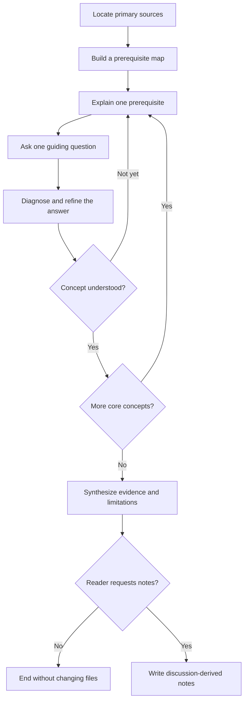

# Paper Reading Skill

An interactive Codex skill for learning research papers through prerequisite-first explanations, adaptive Socratic dialogue, and notes derived from the reader's actual questions.

Instead of immediately producing a comprehensive summary, the skill helps the reader build the concepts needed to understand the paper, one step at a time. It writes notes only after the reader confirms understanding and explicitly asks to save them.

## Why this skill exists

A paper summary can be complete without being useful. Before a discussion, an assistant does not yet know:

- which prerequisites the reader is missing;
- which equations are unclear;
- which intuitive model the reader already has;
- which experimental claims are easy to misread;
- which explanations will remain useful in a final note.

This skill separates the process into two stages:

1. **Learn through dialogue.** Introduce background, ask one question, diagnose the answer, and adapt the explanation.
2. **Write after understanding.** Organize the final note around the concepts and distinctions that mattered during the discussion.

## How it works



During the learning stage, the skill:

- starts with the minimum background needed to reason about the paper;
- introduces notation only after the intuition is visible;
- asks no more than one substantive question per turn;
- answers direct questions before continuing the guided sequence;
- changes representation when an explanation does not work;
- treats formulas as mechanisms rather than isolated algebra;
- reads experiments as arguments with a question, setup, result, interpretation, and caveat;
- distinguishes the authors' claims from independent inference;
- prefers the original paper, appendices, official project pages, and authors' code.

## The note-writing gate

The skill does **not** create notes, mark a roadmap item as read, or update reading statistics during the discussion.

The gate opens only when the reader both:

1. indicates that they understand the paper; and
2. explicitly asks to organize or save the notes.

The resulting note follows the learning order that worked in the conversation rather than mechanically copying the paper's section order. It preserves useful examples and resolved misunderstandings while keeping paper facts, interpretation, and criticism separate.

## Example session

Invoke the skill explicitly:

```text
$paper-reading-skill Help me understand "Attention Is All You Need."
I know basic neural networks, but I do not know sequence models.
```

The skill should begin by explaining the minimum sequence-model background and then ask one answerable question. A later exchange may look like:

```text
Reader: I think self-attention lets a token directly obtain information
        from another token instead of passing it through every earlier state.

Codex:  That is the key distinction: you identified the shorter information
        path. In an RNN, the dependency travels through a chain of hidden
        states; in self-attention, the two positions interact directly.
        Why does that difference affect parallel training?
```

After the discussion:

```text
Reader: I understand the paper now. Please organize our discussion into notes.
```

Only then should the skill write the note and perform any requested repository updates.

## Installation

Clone the repository into a user-scoped skill directory.

Current OpenAI documentation lists `$HOME/.agents/skills` as the standard user location:

```bash
mkdir -p ~/.agents/skills
git clone https://github.com/KuangjuX/paper-reading-skill.git \
  ~/.agents/skills/paper-reading-skill
```

For Codex setups that load personal skills from `$CODEX_HOME/skills`, install it there instead. With the default Codex home:

```bash
mkdir -p ~/.codex/skills
git clone https://github.com/KuangjuX/paper-reading-skill.git \
  ~/.codex/skills/paper-reading-skill
```

Codex normally detects skill changes automatically. If the skill does not appear, restart Codex.

## Usage

Explicit invocation:

```text
$paper-reading-skill Guide me through <paper title or link>.
```

The skill may also be selected implicitly when a request asks to study or understand a paper through guided questions. It intentionally does not trigger for simple citation lookup, translation, one-shot summarization, or formal peer review unless explicitly invoked.

Useful prompts include:

```text
$paper-reading-skill Check the roadmap and help me understand this paper.
Start by teaching me the prerequisites.
```

```text
$paper-reading-skill Read this PDF with me. Ask one question at a time,
and do not write notes until I say I understand it.
```

```text
$paper-reading-skill I understand the paper now. Turn our discussion into
a concise repository note and update the roadmap.
```

## Repository structure

```text
paper-reading-skill/
├── SKILL.md             # Agent instructions and trigger description
├── agents/
│   └── openai.yaml      # Codex UI metadata and default prompt
├── LICENSE
└── README.md
```

The skill is instruction-only and has no runtime dependencies, scripts, or external tool requirements.

## Design principles

- Understanding before summarization
- Background before questioning
- One concept and one question at a time
- Precise feedback instead of generic praise
- Intuition before notation
- Primary sources before secondary summaries
- Evidence and limitations together
- Explicit authorization before writing files

## License

Licensed under the [Apache License 2.0](LICENSE).
